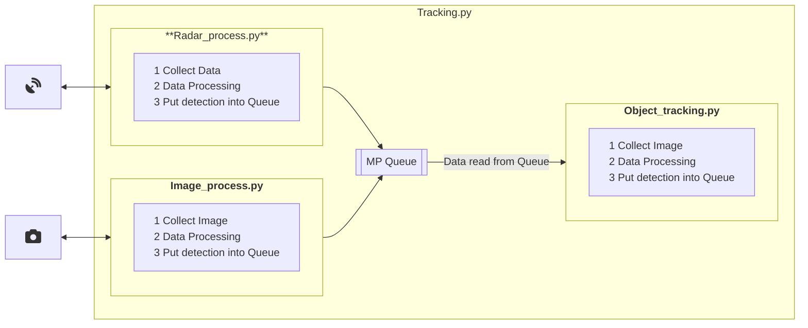

# Object Tracking using Yolov8 and FMCW Radar

Currently in progress. But this project's goal is to create software that can be used to track UAV using both live Radar Sensor data and Video.
This is done as part of a CSI 6900 project.

# Development
Please see the [Development Environment](./docs/devEnviroment.md) Documentation for more details on running this locally.

# Run in Docker
This project can be fully run and configured from a docker container. Follow the steps below to get the image build and running in a container.

## Accessing the Image
### Pulling Image from DockerHub
```bash
# Linux Image
docker pull nbowness/uav-experiments:latest

# Jetson Jetpack 5 Image
docker pull nbowness/uav-experiments:latest-jetson-jetpack5
```

### Building the Container Locally
```bash
# Build conatiner for linux
docker build . -t uav-experiments:latest

# Build container for jetson-jetpack5
docker build . -f Dockerfile-jetson-jetpack5 uav-experiments:latest-jetson-jetpack5
```

## Update Image Tag 
You can update the tag to simply the process for running the container locally. The local name `tracking` will be used for all following examples and commands to simplify the documentation.
```bash
docker tag nbowness/uav-experiments:latest-jetson-jetpack5 tracking
```

## Running the Container On WSL, Linux
```bash
# Interactively launch the container. Example has configuration, data and output volumes mounted. Then you can run commands as you'd like. NOTE this has no UI elements only console
docker run -v "$(pwd)"/data:/data -v "$(pwd)"/configuration:/configuration -v "$(pwd)"/output:/output -it tracking-image --gpus device=0

# Run elements, non interactive
docker run -v "$(pwd)"/data:/data -v "$(pwd)"/configuration:/configuration -v "$(pwd)"/output:/output tracking-image python3 tracking.py --skip-radar

# Run with UI elements active.
xhost +local:docker && docker run -e DISPLAY=$DISPLAY -v /tmp/.X11-unix:/tmp/.X11-unix -v ~/.Xauthority:/root/.Xauthority -v "$(pwd)"/data:/data -v "$(pwd)"/configuration:/configuration -v "$(pwd)"/output:/output -it tracking-image


# Run the tracking software using local webcam, with no UI elements active
docker run -v "$(pwd)"/data:/data -v "$(pwd)"/configuration:/configuration -it tracking-image python3 tracking.py --skip-radar --view-img --device=/dev/video0:/dev/video0 --video-config /configuration/VideoConfig_AnkerCamera.yaml 
```

## Running the Container On Jetson
When running on Jetson. Jetson equips iGPU rather than the dGPU. The OS is also a customized l4t rather than standard Linux. You can use --runtime=nvidia and by default, it will enable GPU for usage.
```bash
# Run the container interactively
docker run -v "$(pwd)"/data:/data  --runtime=nvidia -it tracking-image-json
```

### Easily overwrite configuration in the container
* Details about overwriting this.. How to change config, etc....

# Usage:
```python

# Run the tracking using an mp4 video, disable the radar tracking portion
python3 tracking.py --weights yolov8n.pt --source data/video/M0101.mp4 --conf-thres 0.4 --no-download --view-img --skip-radar

# Run the tracking using a youtube link, disable the radar tracking portion
python3 tracking.py --weights yolov8n.pt --source "https://youtu.be/LNwODJXcvt4" --conf-thres 0.4 --no-download --view-img --skip-radar

# Run just the radar tracking from recorded radar data
python3 tracking.py --weights yolov8n.pt --no-download --view-img --skip-video --radar-from-file --radar-source data/radar/run1_FDs
```

# Folder Structure
This project uses the Ultrlytics images as the [base images](https://github.com/ultralytics/ultralytics/tree/main/docker) for this project. Specifically it uses the normal Dockerfile and the [Dockerfile](https://github.com/ultralytics/ultralytics/blob/main/docker/Dockerfile) and the [Dockerfile-jetson-jetpack5](https://github.com/ultralytics/ultralytics/blob/main/docker/Dockerfile-jetson-jetpack5)

This project rebuilds a new image that add some additional python projects into the `tracking` directory. It will also suggests mounting volumes for `data`, `configuration` and `output` to attach precollected data to process, add configuration options and gather output files mounted to your machine respectively.

For more explict details on the folder structure, and the overview of the configuration options please see [Configuration](./docs/configuration.md) of the docs.

# Data Processing



# Helpful Notes
* [Using a Webcam with the container, and connecting a webcam to WSL](./docs/usingWebcamInContainers.md)
* [Some On Going Dev Notes](./docs/devNotes.md)
