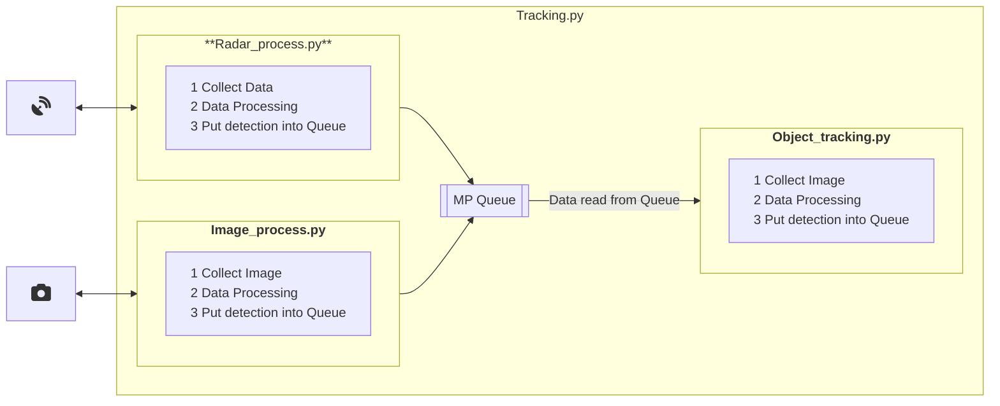

# UAV Object Tracking (CSI 6900)

Currently in progress. But this project's goal is to create software that can be used to track UAV using both live Radar Sensor data and Video.  

# Setup Requirements - Using Docker and VSCode
- If you have Docker installed on your computer, you can leverage developer containers to quickly run this project.
- You need to install the VS Code "Dev Containers" extension. After that, you can re-open the repository in a container with all dependencies included. 

# Setup Requirements
- If you are running this on your computer, you will need the following two pieces installed:
  1. Python 3.8
  2. Pip
- Once you have those two installed run `pip install -r requirements.txt` or setup a virtual environment for the project using 

# Usage:
```python

# Run the tracking using an mp4 video, disable the radar tracking portion
python3 object_tracking.py --weights yolov8n.pt --source data/video/M0101.mp4 --conf-thres 0.4 --no-download --view-img --skip-radar

# Run the tracking using a youtube link, disable the radar tracking portion
python3 object_tracking.py --weights yolov8n.pt --source "https://youtu.be/LNwODJXcvt4" --conf-thres 0.4 --no-download --view-img --skip-radar

# Run just the radar tracking from recorded radar data
python3 object_tracking.py --weights yolov8n.pt --no-download --view-img --skip-video --radar-from-file --radar-source data/radar/run1_FDs
```

# Folder Structure
This project uses the Ultrlytics images as the [base images](https://github.com/ultralytics/ultralytics/tree/main/docker) for this project. Specifically it uses the normal Dockerfile and the [Dockerfile](https://github.com/ultralytics/ultralytics/blob/main/docker/Dockerfile) and the [Dockerfile-jetson-jetpack5](https://github.com/ultralytics/ultralytics/blob/main/docker/Dockerfile-jetson-jetpack5)

This project rebuilds a new image that add some additional python projects into the `tracking` directory. It will also suggests mounting volumes for `data`, `configuration` and `output` to attach precollected data to process, add configuration options and gather output files mounted to your machine respectively.

For more explict details on the folder structure, and the overview of the configuration options please see [Configuration](./docs/configuration.md) of the docs.

# Data Processing



# Helpful Notes
* [Connecting a Windows Webcam to WSL to enable usage in a container](./docs/connectWebcamToWsl.md)
* [Some On Going Dev Notes](./docs/devNotes.md)
