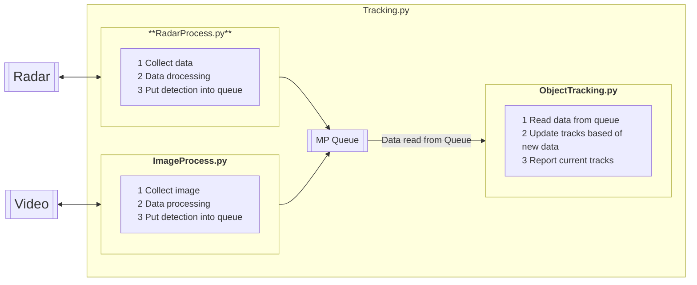

# Object Tracking using Yolov8 and FMCW Radar

This project's goal is to create software that can be used to track objects from a UAV using both live radar sensor data and video using Yolo.

# Documentation

The project is **currently in progress**. 
The best way to view the documentation for this project is to visit the [documentation's website](https://nathanbowness.github.io/UAV-Object-Tracking/). That will have the best formatting, and more information than provided here. This README contains some examples, and high level documentation/examples. 

## Running Documentation Website Locally
Run the following command from the terminal to launch a local browser with all documentation:
```
mkdocs serve
```

Note: If not using the provided developer container, you may need to install MKDocs with `pip install mkdocs-material`

# Development and Running Locally
Please see the [Development Environment](./docs/devEnviroment.md) Documentation for more details on running this project locally and developing.

# Run in Docker
This project can be fully run and configured from a docker container. Follow the steps below to get the image build and running in a container.

## Accessing the Image
### Pulling Image from DockerHub
```bash
# Linux Image
docker pull nbowness/uav-experiments:latest

# Jetson Jetpack 5 Image
docker pull nbowness/uav-experiments:latest-jetson-jetpack5
```

### Building the Container Locally
```bash
# Build conatiner for linux
docker build . -t uav-experiments:latest

# Build container for jetson-jetpack5
docker build . -f Dockerfile-jetson-jetpack5 uav-experiments:latest-jetson-jetpack5
```

## Update Image Tag 
You can update the tag to simply the process for running the container locally. The local name `tracking-image` will be used for all following examples and commands to simplify the documentation.
```bash
docker tag nbowness/uav-experiments:latest-jetson-jetpack5 tracking-image
```

## Running the Container On WSL, Linux
Below includes a series of commands that can be used to interact and run the container. For a full list of options, and some quickstart guides please see [Running In Docker](./docs/guides/runningInDocker.md). 
Below will show a few examples to get you started.
```bash
# Run the container interactively, letting you access the contents
docker run -it tracking-image  

# Run the tracking algorithm with default parameters
docker run -it tracking-image python3 tracking.py

# Interactively launch the container, with configuration, data and output volumes mounted. Please see the configuration section for more details. 
# Once launched you can run commands as you'd like
docker run -v "$(pwd)"/data:/data -v "$(pwd)"/configuration:/configuration -v "$(pwd)"/output:/output -it tracking-image

# Run tracking without radar enabled
docker run -v "$(pwd)"/data:/data -v "$(pwd)"/configuration:/configuration -v "$(pwd)"/output:/output -it tracking-image python3 tracking.py --skip-radar

# Run tracking without video enabled, and a different radar IP
docker run -v "$(pwd)"/data:/data -v "$(pwd)"/configuration:/configuration -v "$(pwd)"/output:/output -it tracking-image python3 tracking.py --skip-video --radar-ip 10.0.1.60

# Run with UI elements active.
xhost +local:docker && docker run -e DISPLAY=$DISPLAY -v /tmp/.X11-unix:/tmp/.X11-unix -v ~/.Xauthority:/root/.Xauthority -v "$(pwd)"/data:/data -v "$(pwd)"/configuration:/configuration -v "$(pwd)"/output:/output -it tracking-image

# Run the tracking software using local webcam, with no UI elements active
docker run -v "$(pwd)"/data:/data -v "$(pwd)"/configuration:/configuration -it tracking-image python3 tracking.py --skip-radar --view-img --device=/dev/video0:/dev/video0 --video-config /configuration/VideoConfig_AnkerCamera.yaml 
```

## Running the Container On Jetson
When running on Jetson. Jetson equips iGPU rather than the dGPU. The OS is also a customized l4t rather than standard Linux. You can use --runtime=nvidia and by default, it will enable GPU for usage.
All commands above are still valid as well, just use the jetson base image and include `--ipc=host --runtime=nvidia`. To help synchronize the start time of the radar and video processing adding a 30 seconds delay to starting the radar is helpful. Yolo takes approx 30 seconds to install on the Jetson.
```bash
# Run the container interactively
docker run -v "$(pwd)"/data:/data -v "$(pwd)"/output:/output --ipc=host --runtime=nvidia -it tracking-image

# After being inside the container, you can run the following:
python3 tracking.py --radar-start-delay 30 # Add 30 second delay, since loading the Yolo model on Jetson takes a while
```

### Configuration in the container
* To configure the container, there are 2 options. Adding new configuration files, or using the CLI. Details for both are linked below:
* [Configuration Using CLI](./docs/configuration/cliArguments.md)
* [Configuration Using Config Files](./docs/configuration/configuration.md) 

# Folder Structure
This project uses the Ultrlytics images as the [base images](https://github.com/ultralytics/ultralytics/tree/main/docker) for this project. Specifically it uses the normal Dockerfile and the [Dockerfile](https://github.com/ultralytics/ultralytics/blob/main/docker/Dockerfile) and the [Dockerfile-jetson-jetpack5](https://github.com/ultralytics/ultralytics/blob/main/docker/Dockerfile-jetson-jetpack5)

This project rebuilds a new image that add some additional python projects into the `tracking` directory. It will also suggests mounting volumes for `data`, `configuration` and `output` to attach precollected data to process, add configuration options and gather output files mounted to your machine respectively.

For more explict details on the folder structure, and the overview of the configuration options please see [Configuration](./docs/configuration.md) of the docs.

# Data Processing



# Helpful Notes
* [Using a Webcam with the container, and connecting a webcam to WSL](./docs/usingWebcamInContainers.md)
* [Some On Going Dev Notes](./docs/devNotes.md)
