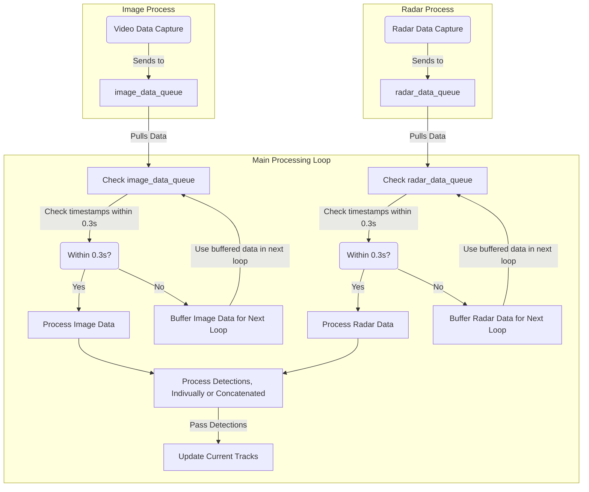

# Object Tracking using Yolov8 and FMCW Radar

This project is **currently in progress**. 

This project's goal is to create software that can be used to track objects using both live radar sensor data and video using yolo. The latest version of this project is using Yolov8 for object detection through video. The radar processing is done using a IMST custom radar toolkit, with custom implemented signal and CFAR processing. The tracking portion of those individual signal results is done using Stone Soup's library.

## Where to Start

* Get a quickstart by running this software in a docker container - [Running in Docker](./guides/runningInDocker.md)
* Customizing the arguments run in the container - [Configuration](./configuration/configuration.md)

## Development

* Please see the [Developer Environment](./setup/devEnviroment.md) section under setup.

## Architecture
The design of this process uses python multiprocess queues to move data between the radar and video processing to the tracking algorithm. 
The queue allows for better synchronization of the data, and abstraction to swap out various video or tracking algorithms in the future. The queue follow the data shape described in [Detections Spec](./configuration/detections-spec.md)

## Algorithm for Data Processing
The system processes data from both radar and video sensors, each sending data to their respective queues: the radar processing queue and the image processing queue. Data from both sensors can arrive at different rates, so a batching mechanism with a 0.3-second window is used to synchronize them.

Every 0.3 seconds, all available data is retrieved from both queues. This window is chosen because it ensures that both radar and video processing have completed at least once in that period. If both radar and video data are available within the same batch, they are combined and used for tracking. If only one is available, it is used alone.

When multiple detections are present within the 0.3-second window, the latest detection is used for tracking. Future improvements will allow either taking an average of the detections or selecting the detection with the highest confidence score for better tracking accuracy.

As performance improves, the batching window can be adjusted to handle data more frequently while maintaining synchronization between the radar and video data.

